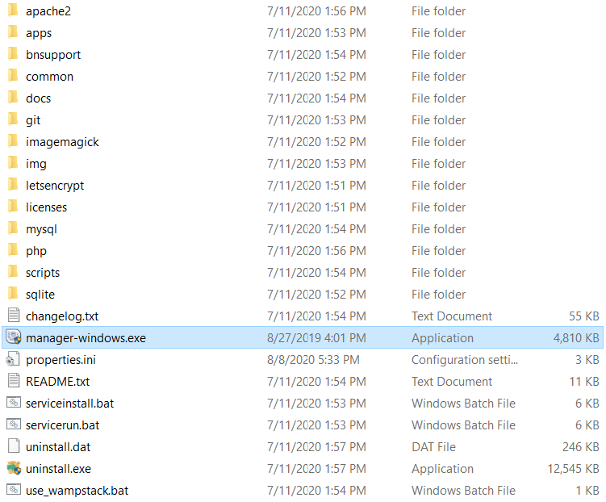
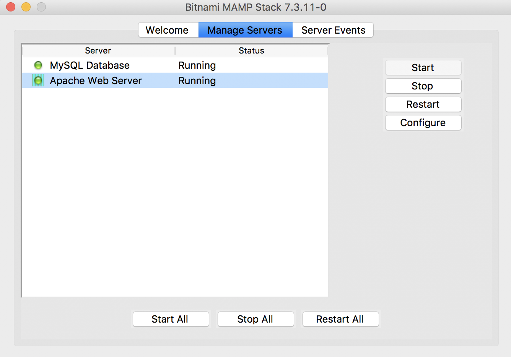
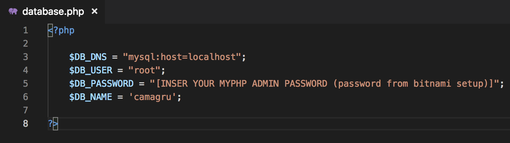
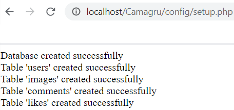
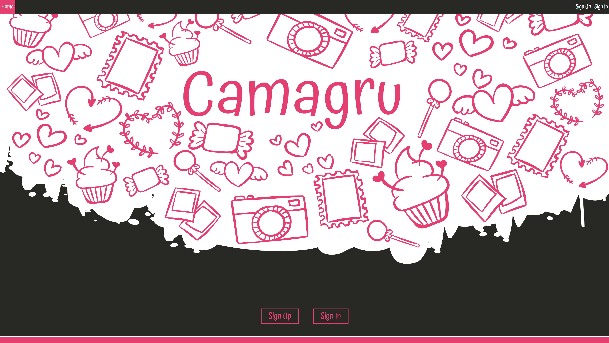
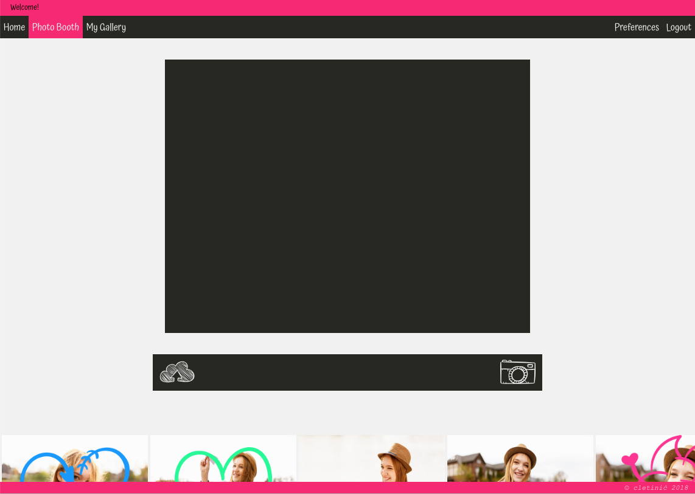
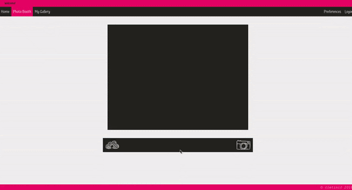
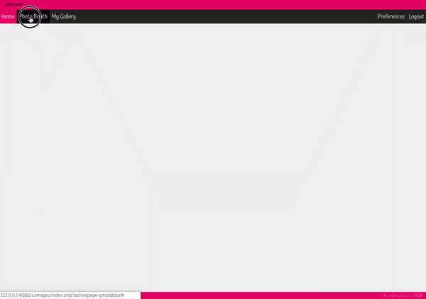

Camagru is a mock/clone image sharing site where users can either upload or take photos with their webcamera and edit them by adding 'stickers' ontop.

The aim of this project, the first Web project from the 42 / WeThinkCode_ curriculum, is to develop a website and demonstrate the learning of the basic fundamentals of web development using CSS, HTML, JS with PHP acting as the backend / server side language. 
 
# Installation

## Prerequisites

A local apache server to host on, in this case we will make use of bitnami local server environments

   - [Bitnami local server environments](https://bitnami.com/stacks/infrastructure)
   
### MacOS

 - Install [Bitnami MAMP](https://bitnami.com/stack/mamp)

### Windows

 - Install [Bitnami WAMP](https://bitnami.com/stack/wamp)

### Linux

> NOTE - this project hasn't been tested on a linux based system

 - Install [Bitnami LAMP](https://bitnami.com/stack/lamp)


# Clone

Clone this repo to your local machine using:

```
cd [Insert path to your MAMP/ WAMP / LAMP Directory ]/apache2/htdocs
git clone https://github.com/CLetinic/Camagru.git
```

# Setup
## Configuring Server Environment

Locate and run the executable file



Start the server 



Browse to site location
http://localhost/Camagru
> NOTE - by default the server is set to port 80  

## Configuring Camagru

### Changing Camagru Variables 

In [Insert path to your MAMP/ WAMP / LAMP Directory ]/apache2/htdocs/Camagru/config/database.php  

Change the password of `$DB_PASSWORD`, to the password chosen during from bitnami setup.



### Creating Database and Tables

To create database and tables:  

In the browser, navigate to  
http://localhost/Camagru/config/setup.php  



# Samples | Screenshots
## Landing | Home page  


## Photobooth


### Uploading A Photo 


### Taking A Photo With The Webcam


# Project Insight
## Project Brief
- [Camagru Project Brief](./misc/documents/camagru.en.pdf)
## Project Markingsheet
- [Camagru Project Marking sheet](./misc/documents/camagru.markingsheet.pdf)
## Project Trello
- [Camagru Trello Card](https://trello.com/c/eI0G1Per/29-camagru)
- [Camagru Trello Board](https://trello.com/b/Zz2Zu2o2)
